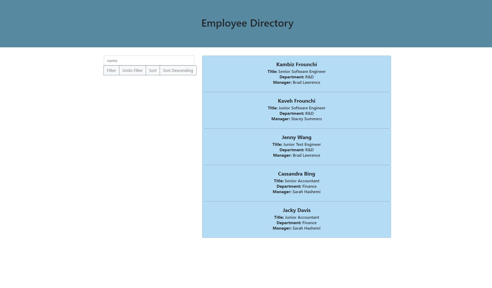

# Employee Directory

## Description

This is a sample react application that is able to show a random table of employees and let's the user sort them by name in ascending or descending order. It also allows the user to filter the employees by name and undo the filter.

There is no backend to this app. It is mainly to show case different react concepts such as the virtual-dom and user defined components, states and hooks.

